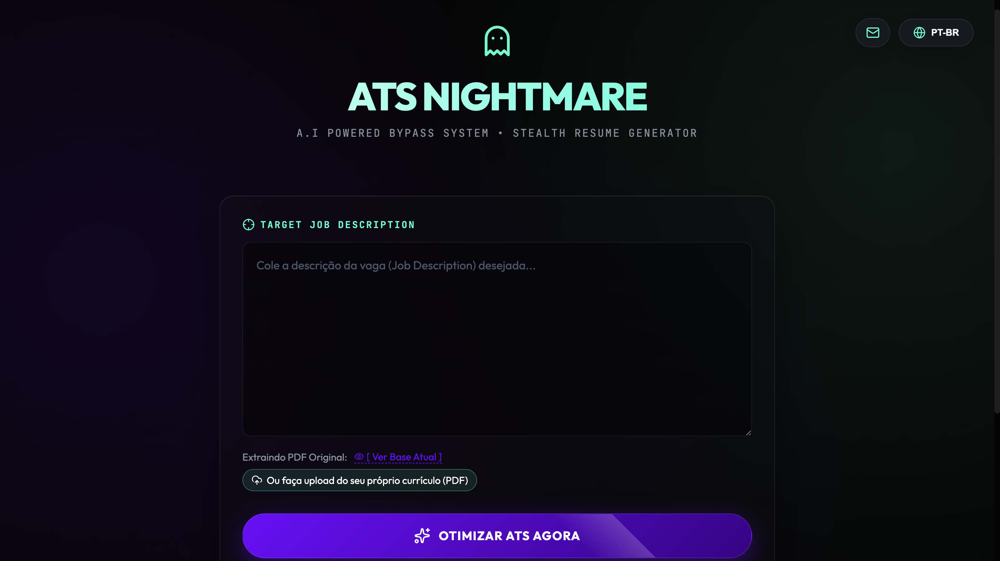
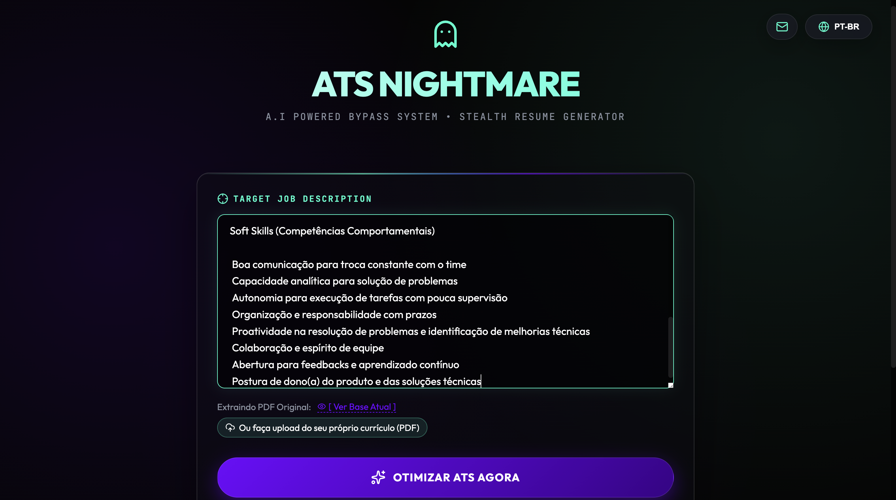
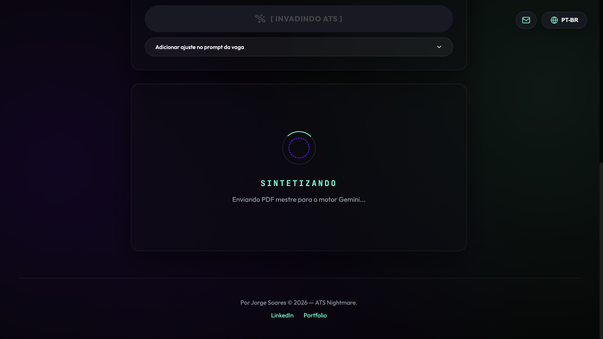
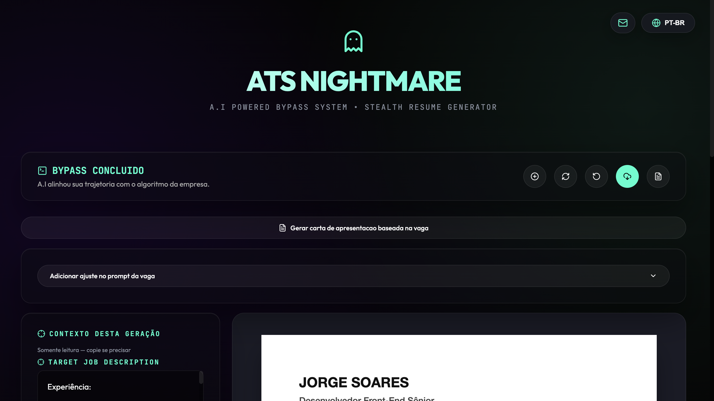
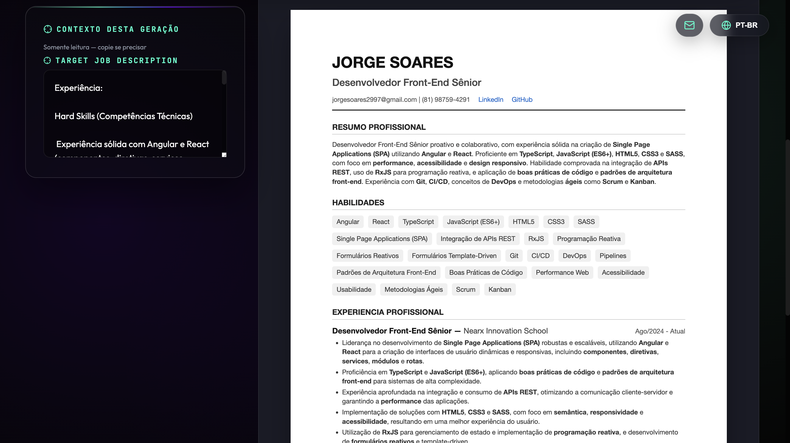
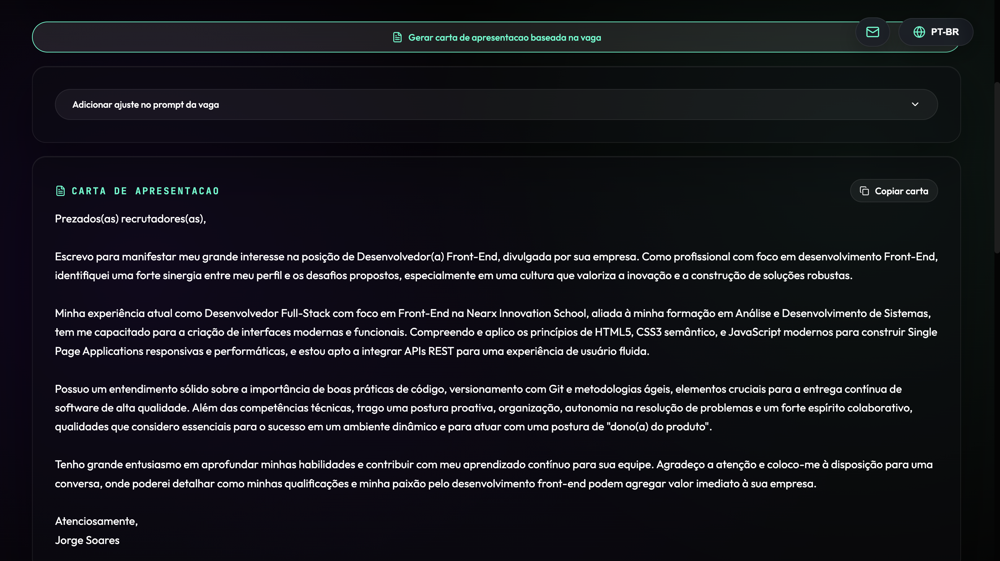

<div align="center">
  
</div>

<h1 align="center">ATS Nightmare 👻</h1>

## 🎯 O problema que o projeto resolve
Se você está cansado de enviar centenas de currículos e ser automaticamente bloqueado pelos robôs de **ATS (Applicant Tracking Systems)** antes mesmo de um humano ler suas experiências, o **ATS Nightmare** atua exatamente nessa dor. Trata-se de uma aplicação focada em atuar como um "bypass" inteligente, maximizando a taxa de conversão do seu currículo. A aplicação recebe a descrição de uma vaga e um currículo base (PDF Mestre), e utiliza Inteligência Artificial para reescrever e otimizar toda a sua narrativa técnica. Ela aplica *keywords* exatas, oculta tecnologias irrelevantes para a vaga e garante que o seu perfil seja o "match perfeito" para os filtros automáticos, mantendo a veracidade das suas habilidades.

## 🛠 Tecnologias utilizadas
- **Framework Core**: [Next.js (v16)](https://nextjs.org/)
- **Frontend & UI**: [React (v19)](https://react.dev/)
- **Inteligência Artificial**: [Google Gemini 2.5 Flash API](https://ai.google.dev/) (`@google/generative-ai`)
- **Linguagem**: [TypeScript](https://www.typescriptlang.org/)
- **Geração de Documentos**: [react-to-print](https://github.com/gregnb/react-to-print) (Renderização e extração de PDF no client-side)
- **Componentes Interativos**: [Tippy.js / @tippyjs/react](https://atomiks.github.io/tippyjs/) (Tooltips) e [Lucide React](https://lucide.dev/) (Ícones)

## 🚀 Como rodar ou acessar o projeto

### Pré-requisitos
- Node.js (v20 ou superior recomendado)
- Gerenciador de pacotes pnpm (ou npm/yarn)
- Chave de API válida do **Google Gemini** (Gemini 2.5 Flash)

### Instalação e Execução local

1. Clone o repositório:
   ```bash
   git clone https://github.com/jorgesoares2997/ats_nightmare.git
   cd ats_nightmare
   ```

2. Instale as dependências:
   ```bash
   pnpm install
   ```

3. Configure as variáveis de ambiente criando um arquivo `.env` na raiz:
   ```env
   GEMINI_API_KEY="SUA_CHAVE_AQUI"
   ```

4. Adicione seu currículo oficial (PDF Mestre):
   Coloque o seu currículo na pasta `public/` com o nome exato de `curriculo_base.pdf`. Este arquivo servirá como o "banco de dados" da sua vida profissional.

5. Inicie o servidor:
   ```bash
   pnpm run dev
   ```
   Acesse `http://localhost:3000`. Cole a descrição da vaga (Job Description) e gere seu PDF customizado.

## ✨ Principais funcionalidades
- **Narrativa Técnica Direcionada**: Reescreve o "Resumo Profissional" e as experiências com base estritamente nas tecnologias exigidas pela vaga alvo, dando o viés exato que o recrutador busca (ex: focar experiência em Java para Microsserviços).
- **Filtro Maximalista Anti-Ruído**: A IA automaticamente oculta linguagens e frameworks que você domina mas que são inúteis para a vaga específica, evitando poluição visual e destacando apenas as *keywords* matadoras nos primeiros segundos de leitura.
- **Tradutor Global (I18N + AI)**: Adapta instantaneamente o currículo inteiro gerado para o inglês ou português dependendo da demanda da vaga.
- **Gerador de PDF Raw e Otimizado**: Sem depender de bibliotecas pesadas, o PDF é "desenhado" e extraído diretamente da árvore DOM no client-side usando `react-to-print`, mantendo hiperlinks ativos em segundos.
- **Operação Stateless e Privada**: O sistema lê as informações, submete a Job Description à IA e encerra a operação sem salvar dados em banco. Sem login, totalmente seguro e voltado à privacidade.

## 🧠 Decisões técnicas tomadas
- **Renderização Client-Side de PDFs (react-to-print)**: Para evitar custos com infraestrutura pesada de geração de PDFs no backend (como Puppeteer ou wkhtmltopdf), optei por utilizar o React DOM para renderizar o currículo na tela e capturar a impressão via browser, garantindo extração instantânea e cliques reais em links.
- **Integração Stateless com Gemini AI**: O motor da aplicação não guarda estado permanente de currículos no banco de dados. Ele atua como um *pipeline* efêmero: recebe o PDF Mestre (lido via Node `fs` no Next.js backend/API) e o *prompt* da vaga, processa o JSON otimizado com a LLM do Gemini e devolve os dados estruturados para a interface.
- **Arquitetura Fullstack Next.js (App Router)**: A escolha do Next.js permitiu combinar rotas de API seguras (para ocultar a API Key do Gemini e fazer a leitura no file system) com a reatividade do React 19 no frontend, tudo num único repositório.

## 📸 Prints, vídeo, deploy ou exemplos de uso
- **Deploy:** [https://ats-nightmare.vercel.app/](https://ats-nightmare.vercel.app/)

> *Screenshots do processo de otimização*

### Home Page


### Descrição da Vaga Adicionada


### Tela de Carregamento


### Painel de Instrumentos


### Currículo Otimizado (Resultado)


### Carta de Apresentação Gerada


## 🔮 Próximos passos de melhoria
- **Análise Reversa de Match Score**: Implementar um sistema de pontuação (score 0-100%) mostrando o quão aderente o currículo mestre estava da vaga antes e depois da otimização.
- **Extração via OCR / Multi-formatos**: Suportar a leitura do currículo base não só em PDF local, mas a partir de URL do LinkedIn ou extração de texto bruto (TXT/Word).
- **Extensão para Browser**: Transformar a aplicação em uma extensão Chrome que captura a vaga direto das plataformas (Gupy, LinkedIn) e injeta o currículo otimizado com um clique.
- **Múltiplos Templates Visuais**: Adicionar opções de design/layout para o PDF gerado (Moderno, Minimalista, Harvard), adequando-se não apenas aos robôs ATS, mas também ao gosto humano de diferentes indústrias.
